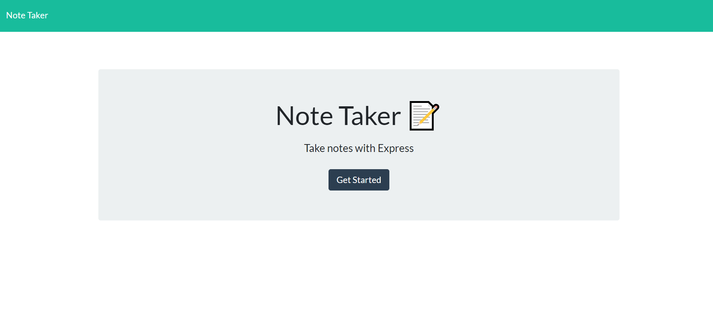

# Note_taker007 - Express 

## Description
This application is to write, save, and delete notes. This NodeJS application uses an Express backend to save and get note list.

Here is a deployment link to Heroku from this GitHub repo. [Live NoteTaker App] https://syed-notetaker.herokuapp.com/

 

## Usage
The application uses the following API routes:

GET /api/notes - reads the db.json file and returns all saved notes as JSON

POST /api/notes - receives a new note to save on the request body, adds it to the db.json file, and then returns the new note to the client

DELETE /api/notes/:id - receives a query parameter containing the id of a note to delete. This means each note has a unique id when it's saved. In order to delete a note, all notes are read from the db.json file, and the note with the given id property is removed.

## Install 
Dependencies neede for this project:

- express

use command: npm install inquirer & use command: npm install express

## Testing 
To test and host the site locally, use command: 

node server

## Support

If you have any questions, or open issues about the repo, I can be reached at: 

Email: ahsan.ali0307@gmail.com 

GitHub: @ahsan13101994.